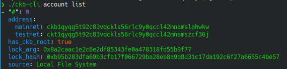
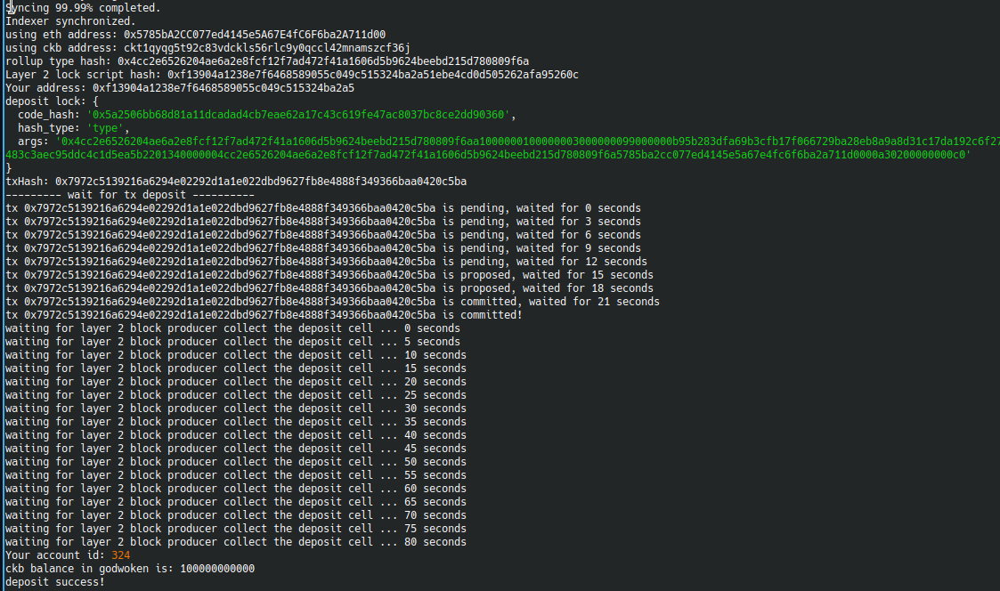

# Gitcoin: 1) Create a Godwoken Account on the EVM Layer 2 Testnet
[Gitcoin 1](https://gitcoin.co/issue/nervosnetwork/grants/2/100026208)

### 1. Create and Fund an Account with CKBytes on Layer 1

#### List account

#### L1 deposit on block explorer
[Block explorer link](https://explorer.nervos.org/aggron/address/ckt1qyqg5t92c83vdckls56rlc9y0qccl42mnamszcf36j)

### 2. Deposit some CKBytes on Layer 2

