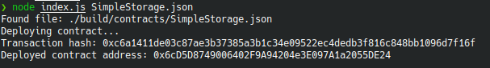

# Gitcoin: 2) Deploy a Simple Ethereum Smart Contract on Polyjuice

## Contract complete screenshot

## Transaction hash
0xc6a1411de03c87ae3b37385a3b1c34e09522ec4dedb3f816c848bb1096d7f16f

## Contract address
0x6cD5D8749006402F9A94204e3E097A1a2055DE24
