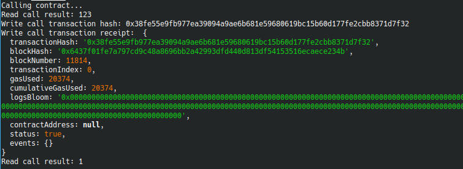

# Gitcoin: 3) Issue a Smart Contract Call to the Deployed Smart Contract

1. A screenshot of the console output immediately after you have successfully issued a smart contract call.
  
1. The transaction hash from the console output (in text format).
  0x38fe55e9fb977ea39094a9ae6b681e59680619bc15b60d177fe2cbb8371d7f32
1. The contract address that you called (in text format).
  0x6cD5D8749006402F9A94204e3E097A1a2055DE24
1. The ABI for contract you made a call on (in text format).
  [{"inputs":[],"stateMutability":"payable","type":"constructor"},{"inputs":[{"internalType":"uint256","name":"x","type":"uint256"}],"name":"set","outputs":[],"stateMutability":"payable","type":"function"},{"inputs":[],"na  me":"get","outputs":[{"internalType":"uint256","name":"","type":"uint256"}],"stateMutability":"view","type":"function"}]
