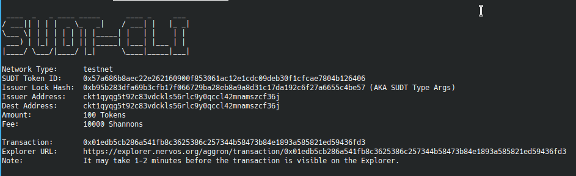
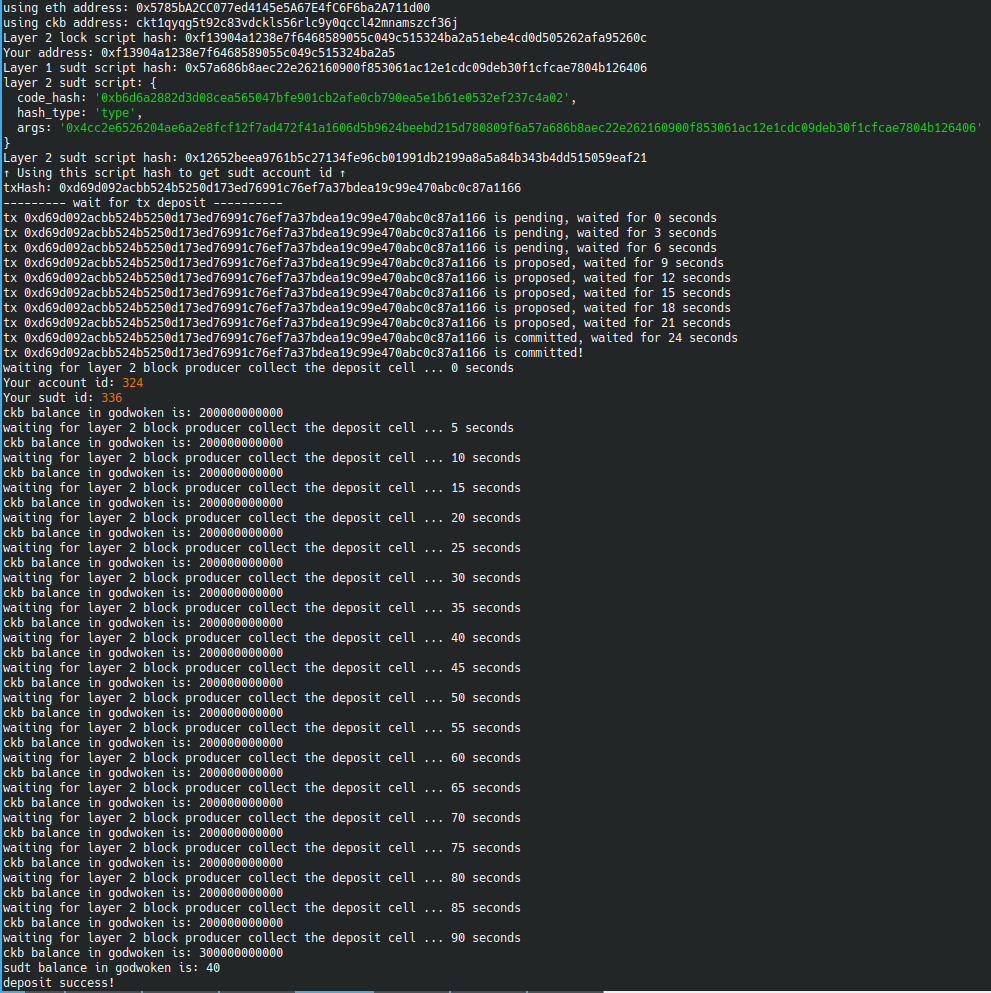

# Gitcoin: 4) Issue an SUDT Token on Layer 1 and Deposit it to Layer 2

### A link to the Layer 1 address you funded on the Testnet Explorer.

### A screenshot of the console output immediately after using sudt-cli to create your SUDT tokens on Layer 1.

### A link to the transaction ID created by sudt-cli on the Testnet Explorer.

### A screenshot of the console output immediately after you have successfully submitted a deposit to Layer 2 using the account-cli tool.

### The SUDT ID from the console output after executing the deposit script (in text format).
`Your sudt id: 336`
