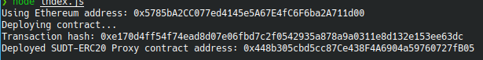

# Gitcoin: 5) Deploy the ERC20 Proxy Contract for the Deposited SUDT

### A screenshot of the console output immediately after deploying smart contract.

### The address of the ERC20 Proxy Contract you deployed (in text format).
`0x448b305cbd5cc87Ce438F4A6904a59760727fB05`

### A screenshot of the console output immediately after checking your SUDT balance.

### The Ethereum address that was checked (in text format).
`0x5785bA2CC077ed4145e5A67E4fC6F6ba2A711d00`

### Bonus: Get Layer 2 SUDT ID from Layer 1 SUDT Issuer Lock Hash (AKA SUDT Type Args)

