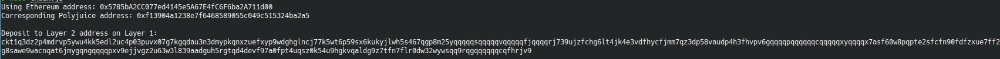

# Gitcoin: 6) Use Force Bridge to Deposit Tokens From Ethereum to Polyjuice

### A screenshot of the console output immediately after you have successfully generated your Deposit Receiver Address.

### Your Deposit Receiver Address (in text format).
`ckt1q3dz2p4mdrvp5ywu4kk5edl2uc4p03puvx07g7kgqdau3n3dmypkqnxzuefxyp9wdghglncj77k5wt6p59sx6kukyjlwh5s467qgp8m25yqqqqqsqqqqqvqqqqqfjqqqqrj739ujzfchg6lt4jk4e3vdfhycfjmm7qz3dp58vaudp4h3fhvpv6gqqqqpqqqqqqcqqqqqxyqqqqx7asf60w8pqpte2sfcfn90fdfzxue7ff2g8sawe9wacnqat6jmygqngqqqqpxv9ejjvgz2u63w3l839aadguh5rgtqd4devf97a0fpt4uqsz0k54u9hgkvqaldg9z7tfn7flr0dw32wywsqq9rqgqqqqqqcqfhrjv9`

### The Ethereum address used to generate the Deposit Receiver Address (in text format).
`0x5785bA2CC077ed4145e5A67E4fC6F6ba2A711d00`

### A link to the Etherscan explorer for the successful Force Bridge transaction. This can be found on Force Bridge under History→Succeed.
<https://rinkeby.etherscan.io/tx/0xb2f83e3f11f778ea0ccd2f851eeabcdad535587dedfffc0e0e67bbc4dda1e599>

### A link to the Nervos explorer for the successful Force bridge transaction. This can be found on Force Bridge under History→Succeed.
<https://explorer.nervos.org/aggron/transaction/0x4fb30fd5f246146893fc420fd6ddb32ce84cff71f29ac259d0acb212b00c9a65>
